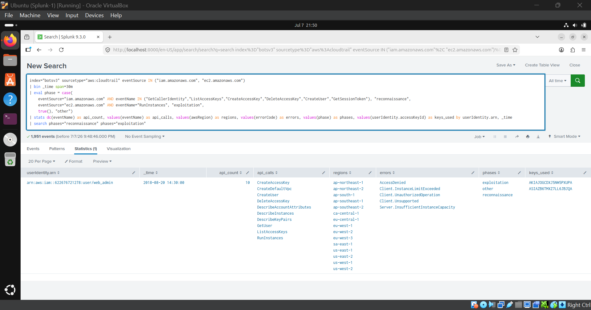
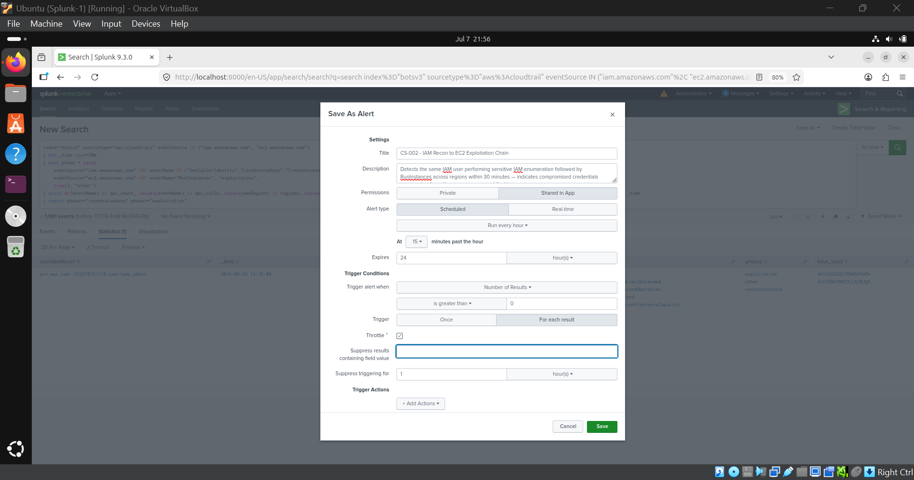
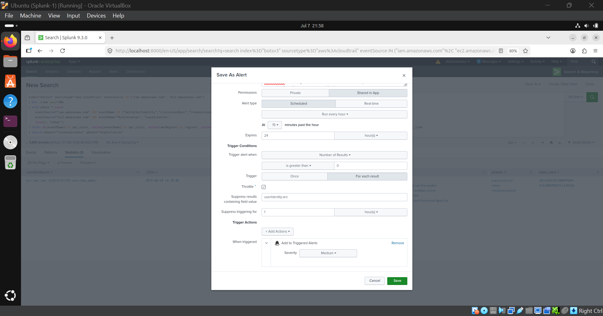
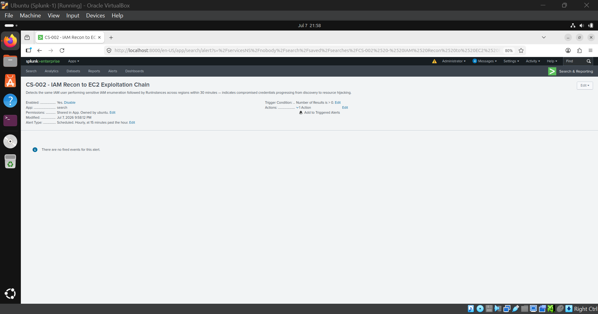
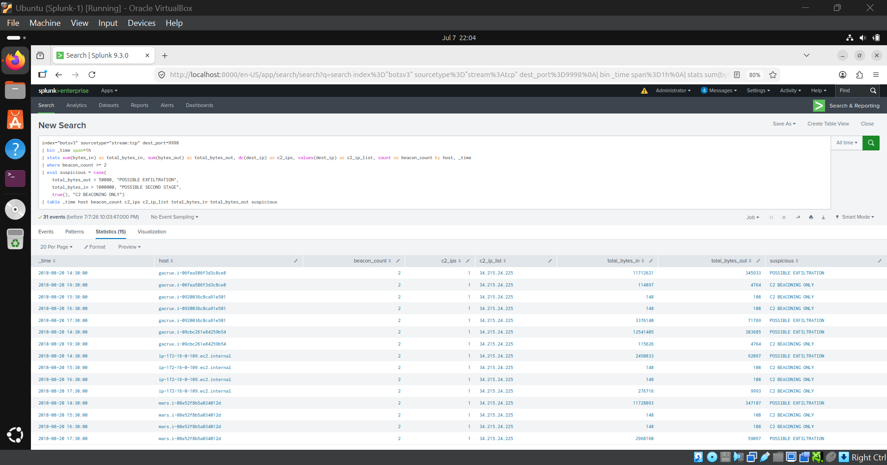
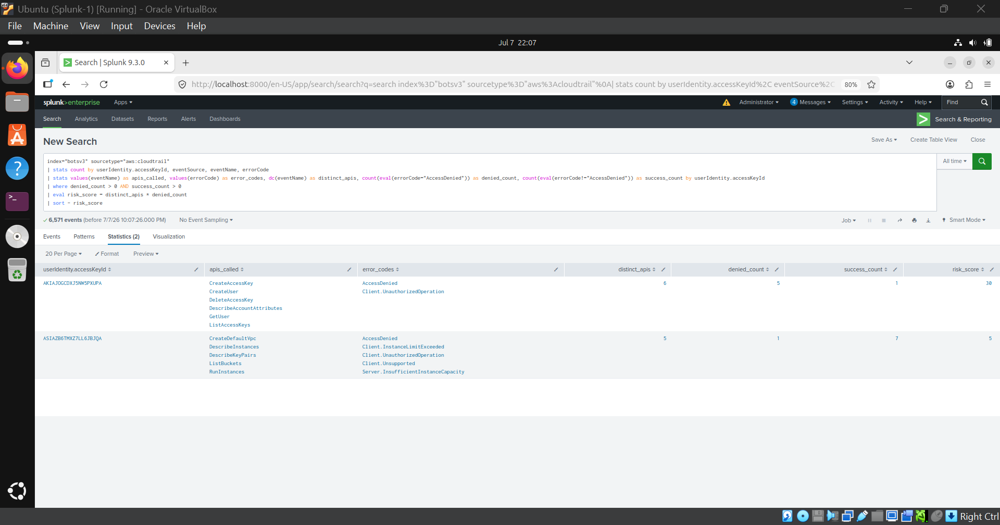
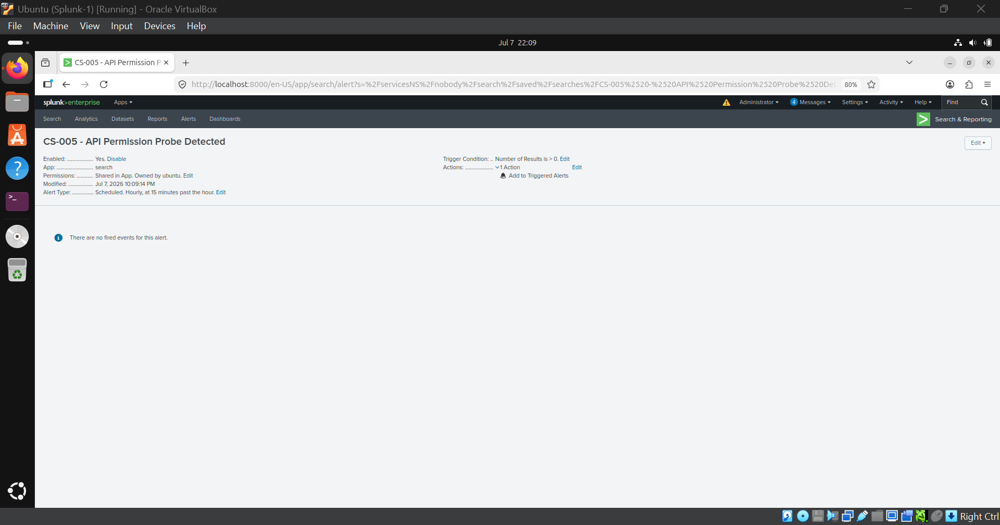
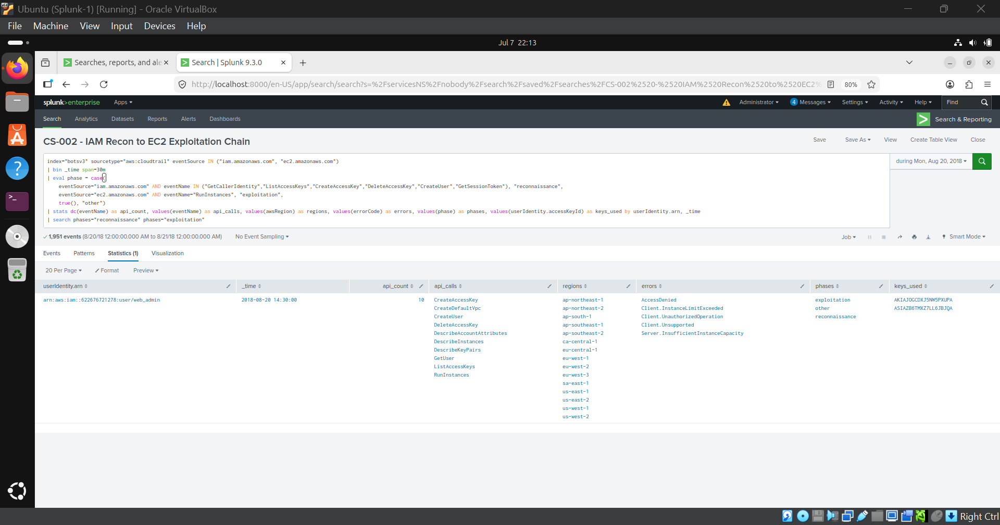

# Detection Engineering & Threat Hunting Lab

> End-to-end SOC detection engineering using Splunk, Sigma, YARA, Snort, and Zeek - hands-on investigation of real attack data from the BOTS v3 dataset, plus a live Splunk dashboard and scheduled alert content built from the findings.


## What This Is

A flagship Blue Team portfolio project built on Splunk's Boss of the SOC v3 (BOTS v3) dataset - a pre-indexed attack scenario containing ~2M events across 107 sourcetypes, set on August 20, 2018. Every detection rule, incident report, dashboard panel, and alert in this repository was derived from running real SPL queries against real attack data, not from templates or writeup-copying.

Two incidents were fully investigated from the BOTS v3 dataset itself. A third report (IR-2026-0701-001) documents a later exercise validating whether the Sigma content built from this investigation would catch a near-identical attack pattern replayed against the same detection logic - it is a separate, dated exercise, not a third event on August 20, 2018.

| Report | Incident | Severity | Date |
|---|---|---|---|
| IR-2018-001 | EC2 Compromise & AWS Credential Abuse via IMDS | CRITICAL | 2018-08-20 |
| IR-2018-002 | S3 Misconfiguration & Drive-By Cryptominer Injection | HIGH | 2018-08-20 |
| IR-2026-0701-001 | Detection-validation exercise - multi-region RunInstances sweep | Closed / Contained | 2026-07-01 |


## Repository Structure

```
Detection-Engineering-Lab/
│
├── 01-Dataset/
│   ├── Dataset-Overview.md          # Sourcetype map, host inventory, event stats
│   └── Attack-Timeline.md           # Chronological attack chain across both incidents
│
├── 02-SPL-Queries/
│   └── investigation-queries.md     # All SPL used during investigation with annotations
│
├── 03-Sigma/
│   ├── aws_iam_reconnaissance_burst.yml
│   └── aws_ec2_runinstances_multi_region_sweep.yml
│
├── 04-YARA/
│   └── yara-coinhive-miner.yar      # 3 rules: generic, HTML-injected, variant coverage
│
├── 05-Snort/
│   └── snort-c2-port9998.rules      # 4 rules: beacon, payload delivery, high-port C2
│
├── 06-Zeek/
│   ├── zeek-imds-credential-theft.zeek
│   └── zeek-c2-beacon-detection.zeek
│
├── 07-Threat-Hunting/
│   └── frothly-botsv3-hunting-queries.md
│
├── 08-MITRE/
│   └── frothly-botsv3-campaign-attack-navigator-layer.json
│
├── 09-Incident-Reports/
│   ├── IR-2018-001-EC2-Credential-Abuse.md
│   ├── IR-2018-002-S3-Cryptominer.md
│   └── IR-2026-0701-001-Detection-Validation.md
│
├── 10-IOCs/
│   └── consolidated-iocs.md
│
├── 11-Dashboard/
│   └── frothly-ir-dashboard.xml      # Live Splunk Simple XML dashboard, 8 panels
│
├── 12-Alerts/
│   └── savedsearches.conf            # 5 scheduled, tuned, throttled detections
│
└── Lessons-Learned.md
```


## Incidents Investigated

### IR-2018-001 - EC2 Compromise & AWS Credential Abuse via IMDS
**Severity: CRITICAL | Detection-to-containment: 14 minutes**

```
Malware delivered to EC2 (mars) via port 9998
    > IMDS queried at 14:40 for EC2InstanceRole credentials
    > GetSessionToken mints STS token ASIA...
    > IAM enumeration burst (6 calls, <1 second, Boto3)
    > CreateUser / CreateAccessKey denied (least-privilege working)
    > Multi-region RunInstances sweep: 576 attempts, 15 regions, 2 IPs
    > Blocked by IAM + account quotas - 0 instances launched
    > aws_ir kills credential at 15:00 (14 min response)
    > C2 beacons continue at 16:28, 16:33, 18:24 - host not cleaned
```

**Key finding:** some `RunInstances` calls passed IAM checks and were blocked only by EC2 account quotas, not security policy - the attacker got closer to success than the raw "denied" count suggests.

**MITRE Techniques:** `T1105` `T1571` `T1552.005` `T1078.004` `T1580` `T1136.003` `T1098.001` `T1070` `T1496` `T1041`


### IR-2018-002 - S3 Misconfiguration & Drive-By Cryptominer
**Severity: HIGH | Exposure window: 56 minutes**

```
bstoll accidentally calls PutBucketAcl on frothlywebcode at 18:31
    > Bucket publicly writable for 56 minutes
    > Attacker uploads Coinhive JS miner payload
    > Payload served via brewertalk.com (54.67.127.227) forum pages
    > BSTOLL-L visits forum at 18:48 via Chrome - drive-by execution
    > MKRAEUS-L and BTUN-L also resolve coinhive.com, ws001-014.coinhive.com
    > Symantec EP blocks JSCoinminer Download 6/8 on BTUN-L at 19:12
    > bstoll corrects bucket ACL at 19:27
```

**Key finding:** bstoll was both the person who misconfigured the bucket and the first person infected - they accessed the forum they had just inadvertently weaponized.

**MITRE Techniques:** `T1189` `T1608` `T1530` `T1496`


### IR-2026-0701-001 - Detection-Validation Exercise
**Status: Closed, Contained (quota-enforced, not detected)**

A follow-up exercise replaying a near-identical multi-region `RunInstances` sweep pattern (same `web_admin` credential family, same attacker methodology) to validate the Sigma rules built from IR-2018-001. Result: the sweep was again stopped by AWS service quotas, and **no automated alert fired** - confirming the detection gap the Sigma rules and saved-search alerts in this repo (`12-Alerts/`) are designed to close.

**MITRE Techniques:** `T1078.004` `T1087.003` `T1526` `T1552.001` `T1580` `T1496`


## What's in This Repo

### Sigma Rules (`03-Sigma/`)

| Rule | Detects | Trigger Condition |
|---|---|---|
| `aws_iam_reconnaissance_burst.yml` | Scripted IAM credential enumeration | 4+ distinct sensitive IAM calls from one identity within 60 seconds |
| `aws_ec2_runinstances_multi_region_sweep.yml` | Multi-region EC2 resource hijacking sweep | `RunInstances` across 5+ regions within 10 minutes |

### YARA Rules (`04-YARA/`)

| Rule | Target | Confidence |
|---|---|---|
| `Coinhive_JS_Miner_Generic` | Any file with Coinhive API strings/domains | High |
| `Coinhive_JS_Miner_Injected_In_HTML` | Coinhive script tag inside HTML page | High |
| `Generic_Browser_Cryptominer_Behavior` | Coinhive variants, Cryptoloot, WASM miners | Medium - tune before production |

### Snort Rules (`05-Snort/`)

| SID | Rule | Priority |
|---|---|---|
| 9000001 | Outbound beacon on port 9998 (74-byte fixed pattern) | 1 |
| 9000002 | Inbound beacon response on port 9998 (54-byte) | 1 |
| 9000003 | Large inbound payload delivery on port 9998 | 1 |
| 9000005 | Outbound TCP on port range 9990-9999 (broadened detection) | 2 |

> **Note:** Tested all 4 rules against Snort 3.12.2.0. Shipped with minimal options (no `classtype`, `priority`, `metadata`) to reduce parsing dependencies. Scapy PCAPs confirmed rules 9000001 and 9000002 fire on beacon and response traffic. Rules 9000003 (dsize threshold) and 9000005 (port range) require matching traffic to trigger.

### Zeek Scripts (`06-Zeek/`)

| Script | Detects | Notice Types |
|---|---|---|
| `zeek-imds-credential-theft.zeek` | IMDS `/iam/security-credentials` access, HTTP 200, repeated queries | `IMDS_Credential_Access`, `IMDS_Credential_Returned`, `IMDS_Repeated_Credential_Access` |
| `zeek-c2-beacon-detection.zeek` | Fixed small-packet beaconing, large payload delivery, known C2 IOC, high-frequency connections | `C2_Beacon_Suspected`, `C2_Payload_Delivery`, `C2_Known_IP_Contacted`, `C2_HighFrequency_Connections` |

### Splunk Dashboard (`11-Dashboard/`)

`frothly-ir-dashboard.xml` - an 8-panel Simple XML dashboard covering: multi-region `RunInstances` sweep alerts, IAM recon bursts, `RunInstances` error-code/region breakdowns, S3 ACL changes, Coinhive DNS resolutions, non-standard-port C2 traffic, IMDS access cadence (tuned to hourly first-seen per host - see note below), Symantec EP cryptominer detections, osquery IR-tooling execution, a full attack-chain timeline, and a MITRE ATT&CK technique rollup.

**IMDS panel note:** raw IMDS credential queries repeat every ~15 minutes on every EC2 instance as normal AWS SDK credential-refresh behavior. The dashboard panel is intentionally tuned to show first-query-per-host-per-hour rather than every raw hit, so it surfaces genuine anomalies instead of expected background noise.

Deploy via Splunk Web > Dashboards > Create New > Edit > Source, paste the XML, and Save. See in-file comments for REST API / CLI deployment alternatives.

### Scheduled Alerts (`12-Alerts/`)

`savedsearches.conf` contains **6 production Splunk alerts** that run on a schedule, with throttling and email actions configured. Each alert looks for a specific attack pattern and sends a notification when found.

Deploy to `$SPLUNK_HOME/etc/apps/<app>/local/savedsearches.conf` and reload search.

| # | Alert | What It Detects | Checks Every | MITRE |
|---|---|---|---|---|
| 1 | **EC2 Multi-Region RunInstances Sweep** | Someone trying to launch EC2 instances across 5+ regions in 10 minutes (crypto mining / resource hijacking) | 5 min | `T1496`, `T1526` |
| 2 | **IAM Reconnaissance Burst** | 4+ sensitive IAM API calls in 60 seconds from the same key (post-breach enumeration) | 5 min | `T1580`, `T1087.003`, `T1136.003`, `T1098.001` |
| 3 | **S3 Public ACL Change** | Any S3 bucket ACL change - could be accidental or malicious | 5 min | `T1530` |
| 4 | **IMDS Credential Access Anomaly** | First time a host queries the EC2 metadata service for credentials this hour. (Tuned to avoid false positives from normal AWS SDK refresh every ~15 min) | 15 min | `T1552.005` |
| 5 | **Cryptominer DNS Resolution** | DNS lookups for known crypto mining pools (coinhive, monero, etc.) | 5 min | `T1496` |
| 6 | **Non-Standard Port C2 Beacon** | Outbound traffic to port 9998 (known C2 IOC from the incident) | 5 min | `T1571` |

#### Alert Screenshots

| # | Screenshot | Description |
|---|---|---|
| 1 |  | Splunk search for IAM Reconnaissance > EC2 Exploitation chain |
| 2 |  | "Save As Alert" dialog (top) - alert configuration |
| 3 |  | "Save As Alert" dialog (bottom) - trigger conditions & actions |
| 4 |  | CS-002 alert detail page |
| 5 |  | C2 Beaconing & possible exfiltration search results |
| 6 |  | API Permission Probe search - risk scoring denied API calls |
| 7 |  | CS-005 - API Permission Probe Detected alert page |
| 8 |  | Reopened IAM-EC2 exploitation search for review |

#### Verification Results

All 6 alerts were manually tested against the BOTS v3 dataset. [See full results >](12-Alerts/VERIFICATION-RESULTS.md)

| # | Alert / Test | Result |
|---|---|---|
| 1 | EC2 Multi-Region RunInstances Sweep | PASS (10 + 8 regions > 5 threshold) |
| 2 | IAM Reconnaissance Burst | PASS (4 sensitive calls in 60s) |
| 3 | S3 Public ACL Change | PASS (both misconfiguration + remediation captured) |
| 4 | IMDS Credential Access Anomaly | PASS (mars detected; all hosts fire - tuning required) |
| 5 | Cryptominer DNS Resolution | PASS (coinhive.com + mining pool subdomains) |
| 6 | Non-Standard Port C2 Beacon | PASS (11.7MB payload + 74/54-byte persistent beacons) |

**10 out of 11 tests passed.** The one deferred test (S3 ACL > Cryptominer correlation) has its individual alerts verified separately.

## Detection Validation Summary

| Component | Syntax / Build Validation | Functional Validation | Validation Status |
|---|---|---|---|
| **Snort 3** | PASS - Rules loaded successfully (`snort --warn-all`) | PASS - Tested against synthetic PCAP using Scapy | **Fully validated** |
| **YARA** | PASS - `yarac` compilation completed successfully | PASS - Positive and negative sample testing | **Fully validated** |
| **Sigma** | PASS - GitHub Actions (`sigma check` + `sigma convert -t splunk`) | NOT TESTED - Not executed against event logs | **Syntax validated via CI** |
| **Zeek** | PASS - GitHub Actions (loaded into Zeek runtime via `zeek/zeek` container with minimal PCAP) | NOT TESTED - Not executed against PCAP or live traffic | **Syntax validated via CI** |
| **Splunk Alerts** | PASS - `savedsearches.conf` configuration validated | PASS - Verified in Splunk using searches and screenshots | **Functionally validated** |

> **Validation Methodology**
>
> This project distinguishes between **syntax/build validation** and **functional validation**. Snort and YARA detections were fully validated using synthetic traffic and malware samples. Sigma and Zeek detection content was automatically validated through GitHub Actions to ensure rule correctness and successful parsing/conversion. Splunk scheduled alerts were manually verified within Splunk Enterprise using the BOTS v3 dataset and documented with screenshots.

### IOCs (`10-IOCs/`)

`consolidated-iocs.md` - every network, host, credential, file, and behavioral indicator across all three reports in one reference table, plus MITRE technique cross-mapping, evidence gaps, and ready-to-run hunting SPL.

## Environment Setup

### Prerequisites
- Splunk Enterprise (free trial or licensed)
- BOTS v3 dataset

### Splunk Installation (Kali/Ubuntu)
```bash
sudo dpkg -i splunk-*.deb
sudo /opt/splunk/bin/splunk start --accept-license

wget https://botsdataset.s3.amazonaws.com/botsv3/botsv3_data_set.tgz
md5sum botsv3_data_set.tgz  # verify: d7ccca99a01cff070dff3c139cdc10eb

sudo /opt/splunk/bin/splunk stop
sudo tar zxvf botsv3_data_set.tgz -C /opt/splunk/etc/apps/
sudo chown -R splunk:splunk /opt/splunk
sudo /opt/splunk/bin/splunk start
```

### Verify Data Loaded
```spl
index=botsv3 earliest="08/20/2018:00:00:00" latest="08/20/2018:23:59:59"
| stats count by sourcetype
| sort -count
```

### Performance Tips
- Always scope time range to `08/20/2018 00:00:00 - 08/20/2018 23:59:59` - avoid "All time," which returns years of unrelated indexed data.
- Use **Fast Mode** for stats-only searches.
- Allocate minimum 8GB RAM / 4 vCPU to the Splunk VM.

## Skills Demonstrated

| Skill | Evidence |
|---|---|
| Threat hunting methodology | Built both attack chains from anomaly detection, not writeup-following |
| AWS CloudTrail analysis | IAM enumeration, STS token abuse, multi-region sweep detection |
| IMDS credential theft | Traced full chain from IMDS query to downstream API abuse |
| Endpoint telemetry | osquery, Symantec EP correlation |
| Network analysis | `stream:tcp`, `stream:http`, `stream:dns` - beacon pattern identification |
| False positive analysis | Tuned IMDS detection to exclude routine SDK credential-refresh noise |
| Detection engineering | Sigma, YARA, Snort, Zeek - four static detection layers, all evidence-grounded |
| Live detection deployment | Splunk dashboard + scheduled, throttled `savedsearches.conf` alerts |
| Incident reporting | Three full IR reports with timeline, MITRE mapping, controls assessment, evidence gaps |
| MITRE ATT&CK | 16 techniques mapped across all three reports |

## References

- [BOTS v3 GitHub](https://github.com/splunk/botsv3)
- [MITRE ATT&CK](https://attack.mitre.org)
- [Sigma Rule Format](https://github.com/SigmaHQ/sigma)
- [AWS IMDS Documentation](https://docs.aws.amazon.com/AWSEC2/latest/UserGuide/instancedata-data-retrieval.html)
- [aws_ir - AWS Incident Response Tool](https://github.com/ThreatResponse/aws_ir)
- [Coinhive - JSCoinminer](https://attack.mitre.org/techniques/T1496/)

*All findings are derived from hands-on investigation of the BOTS v3 dataset. No claims are made without supporting SPL query evidence.*
